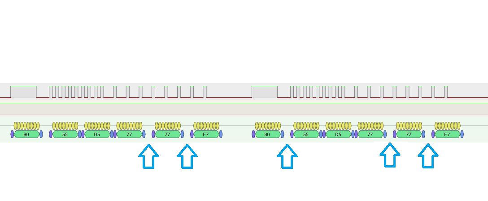

# Kitchen Hood UART Controller (ESPHome + ESP32)

## Описание

Этот проект позволяет заменить штатную сенсорную плату кухонной вытяжки KRONA (Модель: SELINA 900 Glass White S) на модуль ESP32 с интеграцией в Home Assistant через ESPHome. Управление вытяжкой осуществляется по UART (500 бод, инвертированный сигнал с кастомизацией (фиксированные паузы между байтами в фреймах).



## Возможности

- Управление вытяжкой из Home Assistant (Переключатели: Подсветка, Звук нажатия кнопок, Скорость мотора 0, Скорость мотора 1, Скорость мотора 2, Скорость мотора 3)
- Эмуляция оригинальных UART-команд вытяжки.
- Гибкая настройка последовательностей команд и пауз между ними
- Поддержка инверсии сигнала UART

## Алгоритм работы

1. После включения ESP32 отправляет стартовую последовательность байтов (`start1_seq_ - start4_seq_`).
2. Затем бесконечно отправляет массив дежурного режима (`standby_seq_`).
3. При нажатии кнопки "Включить" в Home Assistant — после очередного standby отправляется массив кнопки включения (`button_poweron_seq_`), затем массив рабочего режима (`poweron_seq_`) повторяется бесконечно.
4. При нажатии кнопки "Выключить" — после очередного poweron отправляется массив кнопки выключения (`button_poweroff_seq_`), затем снова начинается цикл standby.


## Аппаратные требования

- ESP32
- Подключение к основной плате вытяжки по UART через преобразователь логических уровней 3.3 -->> 5 В (без инверсии).

## Проблемы

- В данной реализации не получены коды кнопок переключения скоростей при включенной подсветке. В режиме со включенным звуком нажатия кнопок в поток отправляются коды кнопок, которые были получены при выключенной подсветке. В результате в момент отправки кода кнопки происходит кратковременное выключение подсветки. По всей вероятности, переключение режимов происходит путем  установки определенных битов в пакете байтов по какой-то закономерности, но мне этой закономерности не удалось выявить, поэтому в коде отправляются фиксированные для каждого режима и кнопок наборы байтов. С выключенным звуком проблемы нет, так как код кнопки в поток не отправляется (меняется только код режима). 

## Установка

1. Скопируйте папку `custom_components/kitchen_hood` в ваш проект ESPHome.
2. Добавьте две кнопки в Home Assistant для управления вытяжкой.

## Пример конфигурации ESPHome

```yaml
esphome:
  name: kitchen-hood-emulator
  friendly_name: "ESP32 Kitchen Hood"
  on_boot:
    priority: 800
    then:
      - lambda: |-
          WiFi.setSleep(false);

esp32:
  board: esp32dev
  framework:
    type: arduino

wifi:
  ssid: "Your_SSID"
  password: "************"
  manual_ip:
    static_ip: 192.168.1.17
    gateway: 192.168.1.1
    subnet: 255.255.255.0
  ap:
    ssid: "ESP32_KitchenHood"
    password: "**************"
  reboot_timeout: 120s      
    
    
ota:
  platform: esphome
  password: ""

api:
  encryption:
    key: kjhkjhkhhkhkhljjljjjkhkhjkjhkjhk=  #Your key 
  reboot_timeout: 0s   

uart:
  tx_pin:
    number: GPIO13
    inverted: false
  baud_rate: 500
  id: uart_bus

kitchen_hood:
  uart_id: uart_bus
  
external_components:
  - source:
      type: local
      path: custom_components
    components: [kitchen_hood]

logger:    

# Кнопки управления из Home Assistant
button:
  - platform: template
    name: "Motor Speed 0"
    on_press:
      then:
        - lambda: |-
            if (kitchen_hood::KitchenHood::instance) {
              kitchen_hood::KitchenHood::instance->press_motor_speed(0);
            }

  - platform: template
    name: "Motor Speed 1"
    on_press:
      then:
        - lambda: |-
            if (kitchen_hood::KitchenHood::instance) {
              kitchen_hood::KitchenHood::instance->press_motor_speed(1);
            }

  - platform: template
    name: "Motor Speed 2"
    on_press:
      then:
        - lambda: |-
            if (kitchen_hood::KitchenHood::instance) {
              kitchen_hood::KitchenHood::instance->press_motor_speed(2);
            }

  - platform: template
    name: "Motor Speed 3"
    on_press:
      then:
        - lambda: |-
            if (kitchen_hood::KitchenHood::instance) {
              kitchen_hood::KitchenHood::instance->press_motor_speed(3);
            }

  - platform: template
    name: "Light On"
    on_press:
      then:
        - lambda: |-
            if (kitchen_hood::KitchenHood::instance) {
              kitchen_hood::KitchenHood::instance->press_light_on();
            }

  - platform: template
    name: "Light Off"
    on_press:
      then:
        - lambda: |-
            if (kitchen_hood::KitchenHood::instance) {
              kitchen_hood::KitchenHood::instance->press_light_off();
            }

  - platform: template
    name: "Sound On"
    on_press:
      then:
        - lambda: |-
            if (kitchen_hood::KitchenHood::instance) {
              kitchen_hood::KitchenHood::instance->press_sound_on();
            }

  - platform: template
    name: "Sound Off"
    on_press:
      then:
        - lambda: |-
            if (kitchen_hood::KitchenHood::instance) {
              kitchen_hood::KitchenHood::instance->press_sound_off();
            }
```
            

## English

### Kitchen Hood UART Controller (ESPHome + ESP32)

This project replaces the original touch control board of a kitchen hood KRONA (Model: SELINA 900 Glass White S) with an ESP32 module, integrating it into Home Assistant via ESPHome. The hood is controlled via UART (500 baud, inverted signal).

**Features:**
- Control from Home Assistant (two buttons: On and Off)
- Emulates original UART commands
- UART signal inversion support

**How it works:**
1. On power-up, ESP32 sends the start byte sequence twice.
2. Then, it endlessly sends the standby byte sequence.
3. When "On" is pressed in HA, after the next standby, it sends the power-on button sequence, then endlessly sends the power-on sequence.
4. When "Off" is pressed, after the next power-on, it sends the power-off button sequence, then resumes standby loop.
5. Pauses between frames can be set in multiples of 2 ms (bit duration).

**Hardware:**
- ESP32
- UART connection to hood mainboard (TX ESP32 -> RX hood, with inversion if needed)

**Issues**
In this implementation, the button codes for switching speeds with the light on were not obtained. In the mode with the button click sound enabled, the codes of the buttons that were obtained with the light off are sent to the stream. As a result, at the moment of sending the button code, the light turns off briefly. Most likely, mode switching is performed by setting certain bits in the byte packet according to some pattern, but I was not able to determine this pattern, so fixed sets of bytes are sent in the code for each mode and button. With the sound off, there is no problem, since the button code is not sent to the stream (only the mode code changes).

**Installation:**
1. Copy `custom_components/kitchen_hood` to your ESPHome project.
2. Add two buttons in Home Assistant for control.

**ESPHome Example:**  
(see above)

---

## Лицензия

MIT License
